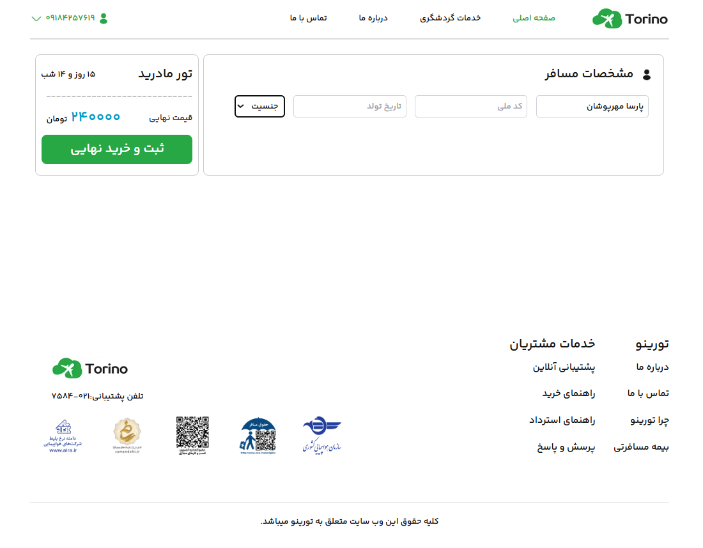
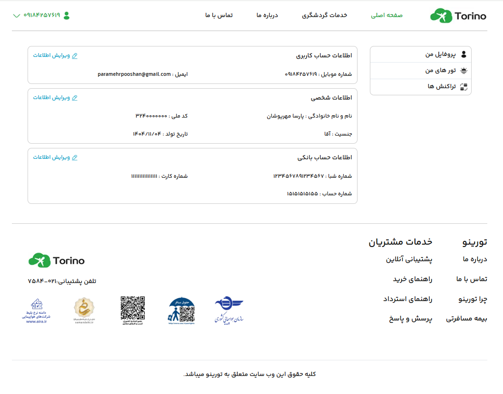
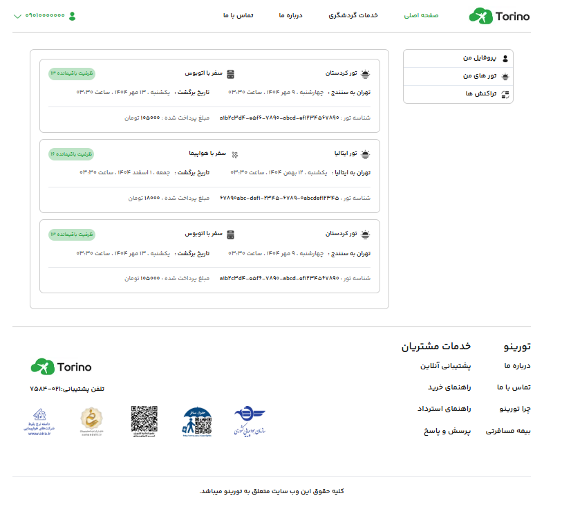
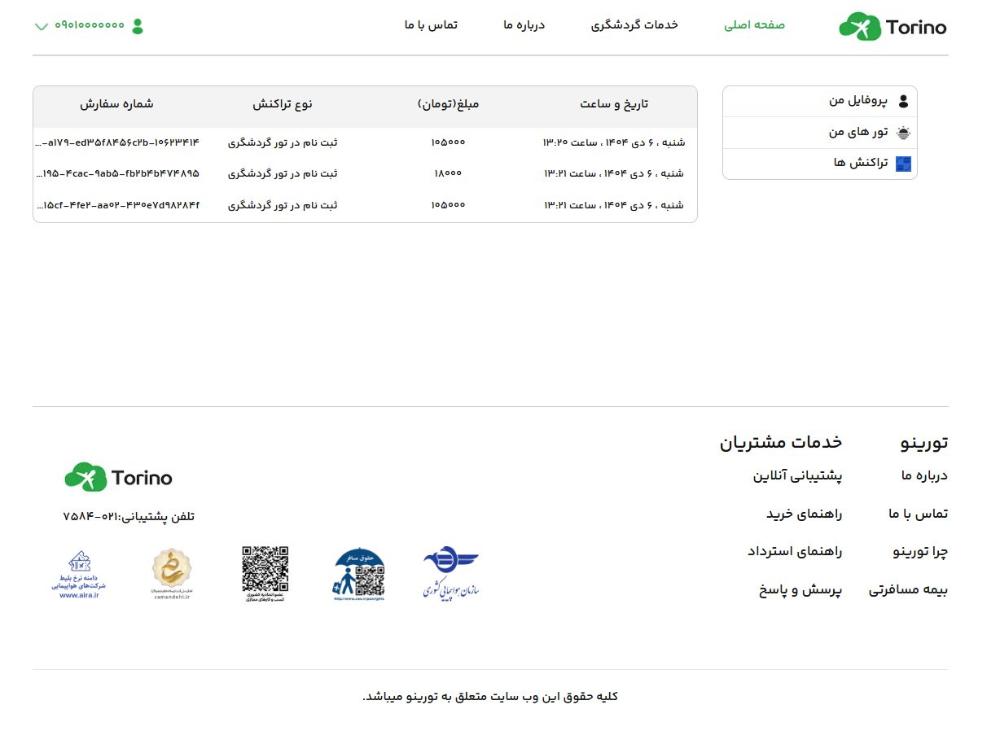

# Torino | اپلیکیشن رزرو آنلاین تور و هتل

## 📝 توضیح کوتاه پروژه

تورینو یک وبسایت رزرو تور و هتل است که کاربران می‌توانند تورهای مختلف را بررسی، رزرو و مدیریت کنند.
این پروژه در بوت‌کمپ **بوتواستارت** و با استفاده از تکنولوژی‌های مدرن فرانت‌اند و بک‌اند پیاده‌سازی شده است.

هدف این پروژه، شبیه‌سازی یک سیستم واقعی رزرو آنلاین با تمرکز بر تجربه کاربری، معماری تمیز و کدنویسی اصولی بوده است.

---

## 🖼 دمو پروژه

🎥 دموی آنلاین پروژه (در حال آماده‌سازی...)

📸 پیش‌نمایش:








---

## 🚀 تکنولوژی‌ها و ابزارهای استفاده‌شده

### ⚙️ تکنولوژی‌ها

* HTML
* CSS
* JavaScript
* React.js
* Next.js (App Router)
* Tailwind CSS
* React Query
* MongoDB
* Figma

---

## 🛠 روش نصب و اجرای پروژه

### 📥 نصب

1. کلون کردن ریپازیتوری:

```bash
git clone https://github.com/username/project-name.git
```

2. ورود به پوشه پروژه:

```bash
cd project-name
```

3. نصب پکیج‌ها:

```bash
npm install
```

4. اجرای پروژه در حالت توسعه:

```bash
npm run dev
```

📍 سپس پروژه روی آدرس زیر در دسترس خواهد بود:

```
http://localhost:3000
```

---

## 🧪 ویژگی‌های اصلی پروژه

✨ قابلیت‌ها:

* احراز هویت کاربران با JWT و ذخیره‌سازی توکن در کوکی
* نمایش و جستجوی تورها با فیلترهای پیشرفته
* امکان رزرو و مدیریت تورها
* داشبورد کاربری برای مشاهده رزروها و تراکنش‌ها
* طراحی ریسپانسیو برای موبایل، تبلت و دسکتاپ
* پشتیبانی از حالت تاریک (Dark Mode)
* مدیریت داده‌ها با React Query

---

## 📞 اطلاعات تماس

📩 ارتباط با من:

* Email: [example@gmail.com](mailto:example@gmail.com)
* Instagram: your-instagram-id

---

## ✅ نکات پایانی

* این پروژه صرفاً جنبه آموزشی دارد.
* خوشحال می‌شوم اگر پیشنهاد یا بازخوردی برای بهبود پروژه داشته باشید ⭐
* اگر پروژه را دوست داشتید، به ریپازیتوری استار بدید 🙌
